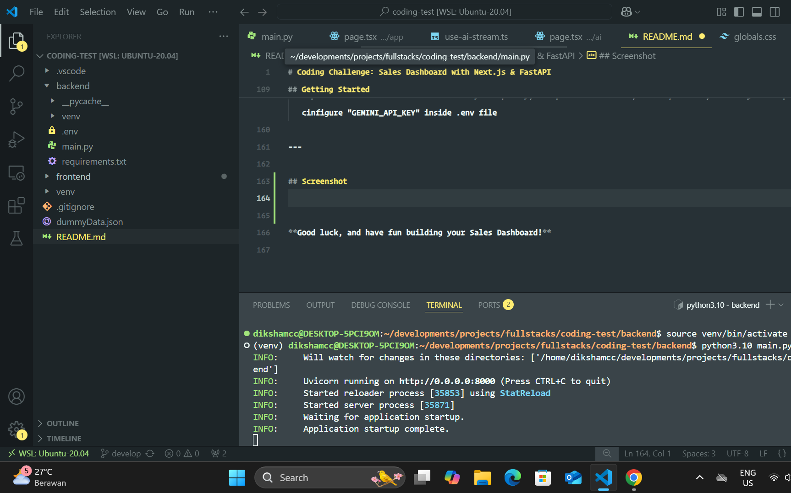
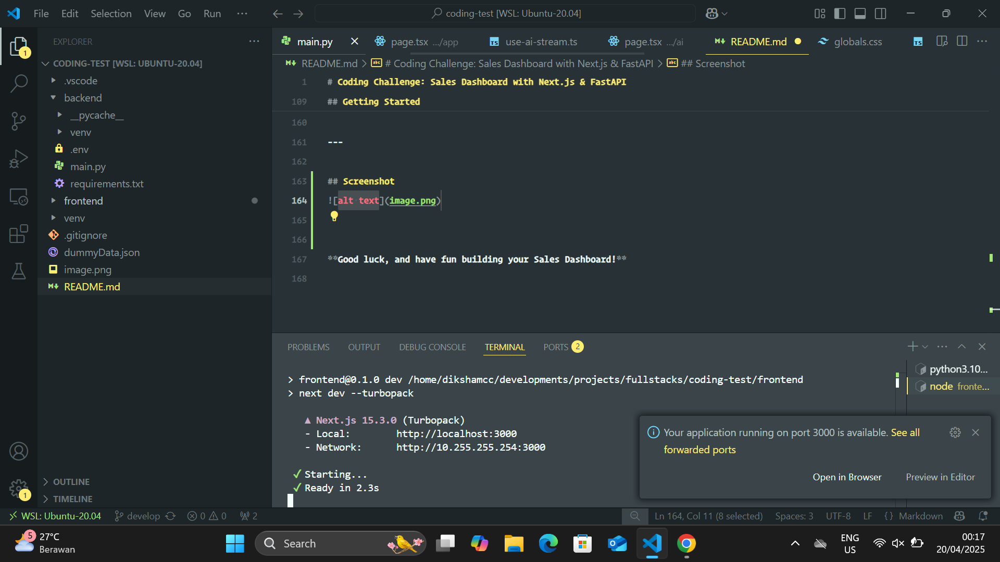
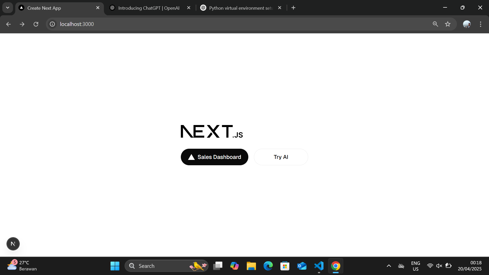
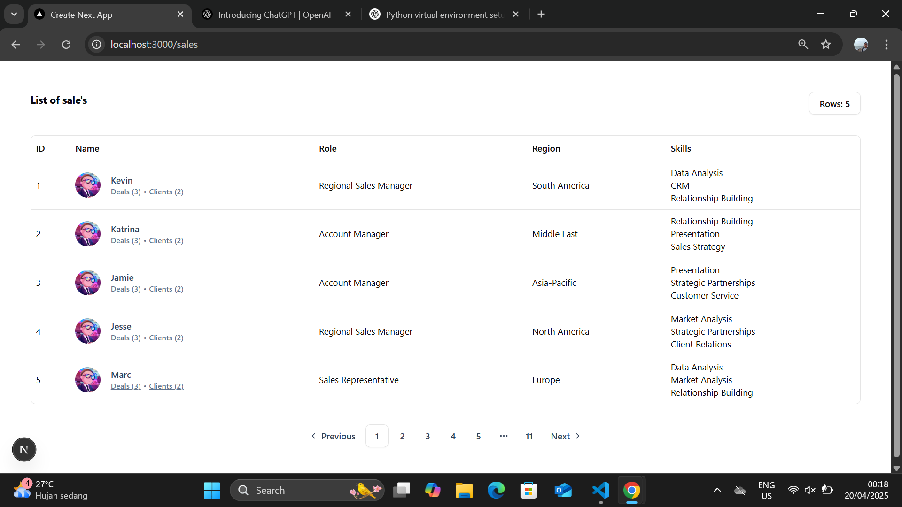
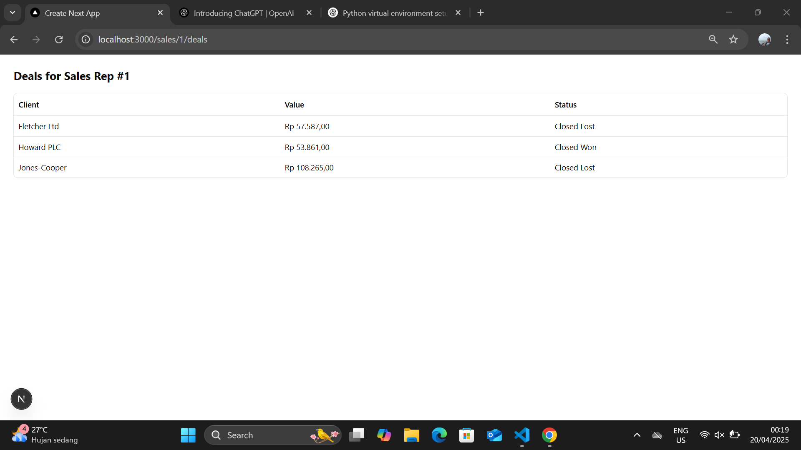
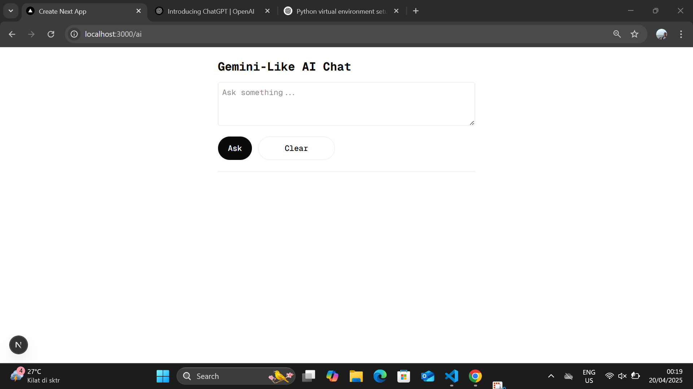
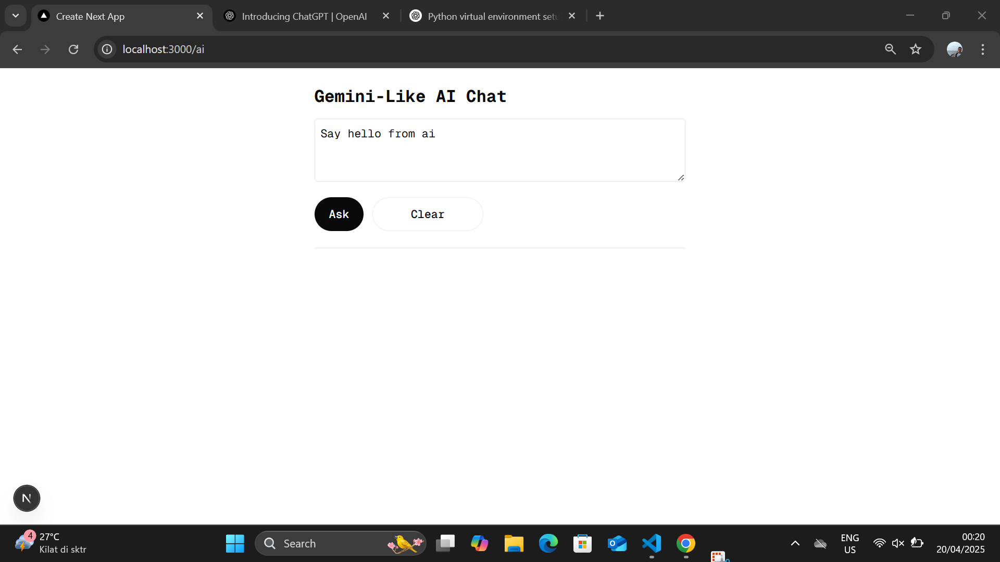
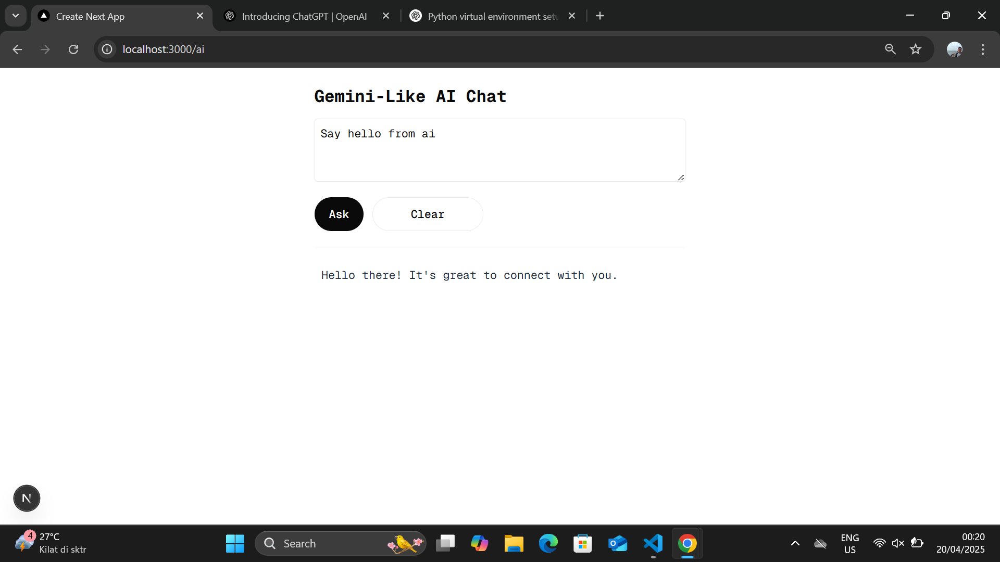

# Coding Challenge: Sales Dashboard with Next.js & FastAPI

## Overview
Your task is to build a simple, full-stack application featuring:
1. **Next.js** as the frontend framework.
2. **FastAPI** as the backend API layer.
3. **Dummy JSON Data** (provided) with sales-related information.

You will parse the provided **`dummyData.json`** and render its nested structures in a user-friendly interface. Optionally, you may include a simple AI feature as a bonus.

---

## Requirements

1. **Data Rendering (Required)**
   - The backend should serve the data from `dummyData.json` via a REST endpoint (e.g., `/api/sales-reps`).
   - The frontend must fetch this data asynchronously and display it in a meaningful way (e.g., a list of sales representatives, their deals, skills, etc.).
   - Demonstrate handling of nested JSON structures. For example, you might display each sales rep’s deals, status, and client details.

2. **UI/UX (Required)**
   - Use **Next.js** to implement at least one page that renders the fetched data.
   - Provide a basic, intuitive UI for viewing the sales reps’ information (e.g., deals, clients).
   - Show a loading state while data is being fetched, and handle potential errors gracefully.

3. **Backend API (Required)**
   - Use **FastAPI** to create an endpoint that returns the JSON data.
   - Implement CORS if needed, so the Next.js app can successfully request data from the FastAPI server.
   - Ensure your API is well-structured and documented (e.g., make use of FastAPI’s automatic docs or docstrings).

4. **Bonus: AI Feature (Optional)**
   - Add an endpoint (e.g., `/api/ai`) that accepts user input (e.g., a question) and returns a generated or placeholder response.
   - Integrate this into the frontend with a simple form or input field where the user can type a question and view the AI’s response.
   - The AI logic can be **mocked** or **rule-based** if you do not wish to integrate an actual AI service. If you prefer, you may call any AI API you have access to (such as OpenAI, etc.).

---

## Using Free LLM APIs

Various Large Language Model (LLM) providers offer free or trial APIs. Here are some examples:

- **Google Gemini API**  
  Google provides a free tier for the Gemini model API with certain usage limits. You can generate an API key and refer to the official documentation for details.

- **Meta’s Llama 2**  
  Meta has open-sourced the Llama 2 model, which can be used for both commercial and research purposes at no cost. You can apply for access and download the model from their official website.

- **Upstage’s Solar**  
  Upstage provides a free API trial for its Solar LLM, showcasing its powerful features. Refer to their official documentation or blog for more information.

Additionally, IBM, Study space, “Stibee,” and others may offer free or trial-based LLM APIs.

> **LangChain**  
> LangChain is a framework that supports integrating multiple LLMs in a unified way. You can check LangChain’s list of integrations to see which models are supported and choose the one that suits your project.

Using these free or trial options can help you add an AI chatbot or similar functionality to your project without significant costs.

---

## Submission Instructions (Fork)

1. **Fork This Repository**  
   - In the top-right corner of this repo page, click on the “Fork” button to create your own copy of the project under your GitHub account.

2. **Clone Your Fork**  
   - After forking, clone your forked repository to your local machine:
     ```bash
     git clone https://github.com/<your-username>/<repo-name>.git
     ```
3. **Implement Your Solution**  
   - Work on your solution locally (both frontend and backend as described below).  
   - Commit your changes in a clean, organized manner.


- Then, go to your forked repository on GitHub and Provide a link to your forked repository and emailing it to us
- Provide a clear description of what you’ve implemented or any notable design choices.

---

## Deliverables

- **Forked Repository**: Contains all changes, with commits reflecting your development process.

---

## Evaluation Criteria

1. **Code Quality & Organization**  
   - Readability, maintainability, and modularity.  
   - Clear separation of concerns between frontend and backend.

2. **Data Handling**  
   - Ability to fetch, parse, and display nested data structures.  
   - Proper use of asynchronous operations and error handling.

3. **UI/UX**  
   - Clean, intuitive interface.  
   - Demonstration of loading states and helpful user feedback.

4. **AI Integration (Bonus)**  
   - Creativity and correctness of the AI feature.  
   - Proper request/response handling on both frontend and backend.

5. **Documentation**  
   - Clarity in the instructions to set up and run the project.  
   - Brief explanation of design choices and potential improvements.

---

## Getting Started

1. **Clone or Download** this repository (or fork it, as described above).
2. **Backend Setup**  
   - Navigate to the `backend` directory.  
   - Create a virtual environment (optional but recommended).  
   - Install dependencies:  
     ```bash
     pip install -r requirements.txt
     ```  
   - Run the server:  
     ```bash
     uvicorn main:app --host 0.0.0.0 --port 8000 --reload
     ```  
   - Confirm the API works by visiting `http://localhost:8000/docs`.
   - Note for running using vEnv - becuase gemini ned latest python -v, please follow these 
   ```
   python3 -m venv venv
   source venv/bin/activate
   python3.10 main.py
   ```

3. **Frontend Setup**  
   - Navigate to the `frontend` directory.  
   - Install dependencies:  
     ```bash
     npm install
     ```  
   - Start the development server:  
     ```bash
     npm run dev
     ```  
   - Open `http://localhost:3000` to view your Next.js app.

4. **Data**  
   - The file `dummyData.json` is located in the `backend` directory (or wherever you place it).
   - Adjust your API endpoint and frontend calls if you use different paths or filenames.

5. **AI Feature (If Implemented)**  
   - Add a POST endpoint to handle AI requests, for example `/api/ai`.  
   - In the frontend, create a simple form to collect user questions and display the returned answer.
   - Feel free to use any **free or trial LLM API** mentioned above or implement a rule-based approach.

6. **Tips for Completion**
   - **Start Small**: Fetch the data, display it, then expand to more complex UI or AI functionality.
   - **Testing**: You may add unit or integration tests if time permits.
   - **UI Libraries**: Feel free to use any UI library or styling approach (Tailwind, CSS modules, etc.) if desired.
   - **Extensions**: You can incorporate charts, filters, or sorting to demonstrate extra skills.

7. **For AI**
   - please before run this fork use the your api key, and place inside ```./bakcend/.env```, am use gemini api, so you must cinfigure "GEMINI_API_KEY" inside .env file

---

## Screenshot 








**Good luck, and have fun building your Sales Dashboard!**
